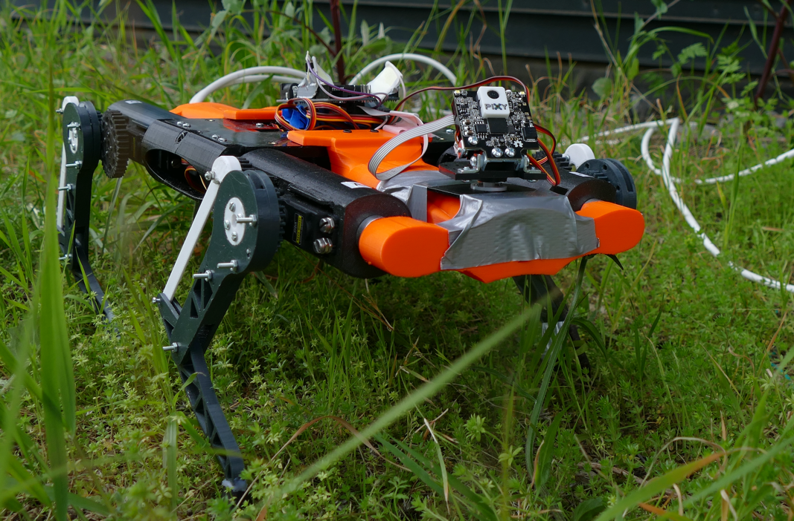

### Hi there 👋 My name is Raphaël Anjou, and I'm currently a student in Polytech Nice Sophia (Peip 2) aiming to go in the Computer Science course of Polytech Nice Sophia as a work-study student.

  
  

## :chart_with_upwards_trend: GitHub Stats

    

## :school: University projects

### 1. PolyDog Robot

**From November 2021 to March 2022 for the V1**  
**From March 2022 to now for the V2**@

This project consisted in building a robot dog using Arduino hardware.  
Here is an image of the robot :

| Polydog Exploded View   |      Polydog in the grass      |
|:----------:|:-------------:|
|  |   |

    

### 2. Rogue-like game

**From March 2021 to June 2021**

**⚠️️ ️WARNING ⚠️ : The code needs a lot of refactoring. The core of the code was created from the teacher and wasn't
allowing us to store classes in separate files (problems of circular import).**

This project was developed as part of an Object-Oriented Class with Python in my first year of university.  
We had to follow the code structure of the teacher for nearly the whole project. The teacher gave us more liberty near
the end, which allowed us get more creative with our work and try to code more complicated features.

    

## :computer: Personal studies

### 1. Java best practices

**Started in February 2022**

During our [course](https://github.com/naxomi/peip2-algorithmique-et-structure-donnees) of Algorithms and Data
Structures, we used Java and I wanted to code the correct way.  
That's why I'm trying to learn the best practices, how to comment correctly my code to be able to create JavaDocs, how
to do unit testing (with Junit5 and Mockito) and how to build correctly the structure of my code.

**Books I use :**

- _Clean Code - A Handbook of Agile Software Craftsmanship_ |---| Robert C. Martin
- _Java Unit Testing with JUnit 5 Test Driven Development with JUnit 5_ |---| Shekhar Gulati, Rahul Sharma
- _Mockito Essentials_ |---| Sujoy Acharya
- _Practical Unit Testing with JUnit and Mockito_ |---| Tomek Kaczanowsk

### 2. GIT

**Started in April 2022**

GIT is currently the distributed version control system most used and has amazing functionalities. Since I will have to
work with it one day, I decided to learn how to use it better.

**Resources I use :**

- _Pro GIT - Everything you need to know about GIT_ |---| Scott Chacon, Ben Straub
- _[Learn GIT branching](https://learngitbranching.js.org/)_ : Website displaying how branching works
- Dozens of articles and videos not mentionned here.

### 3. Try Hack Me

**Started in April 2022**

I'm becoming more and more interested in cybersecurity so I started working with TryHackMe to get the basics at first,
and then be able to progress and learn more complex stuff.

